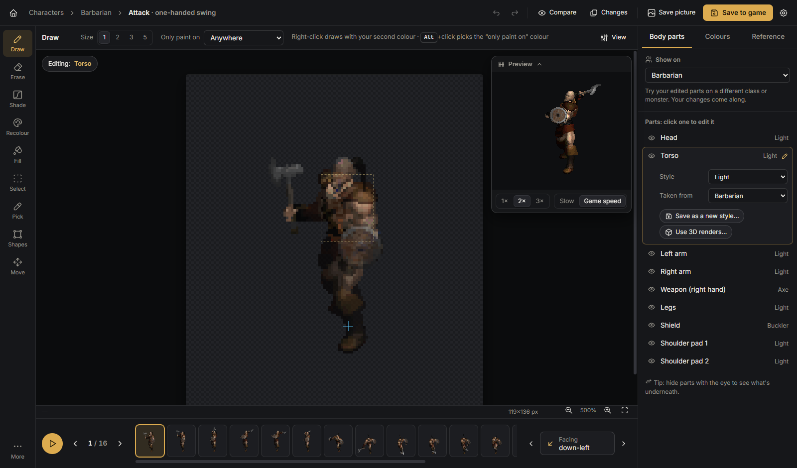
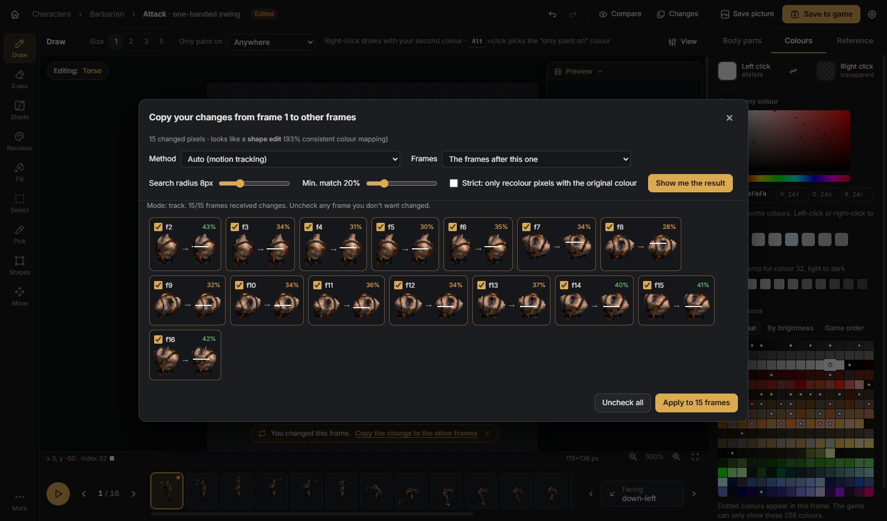
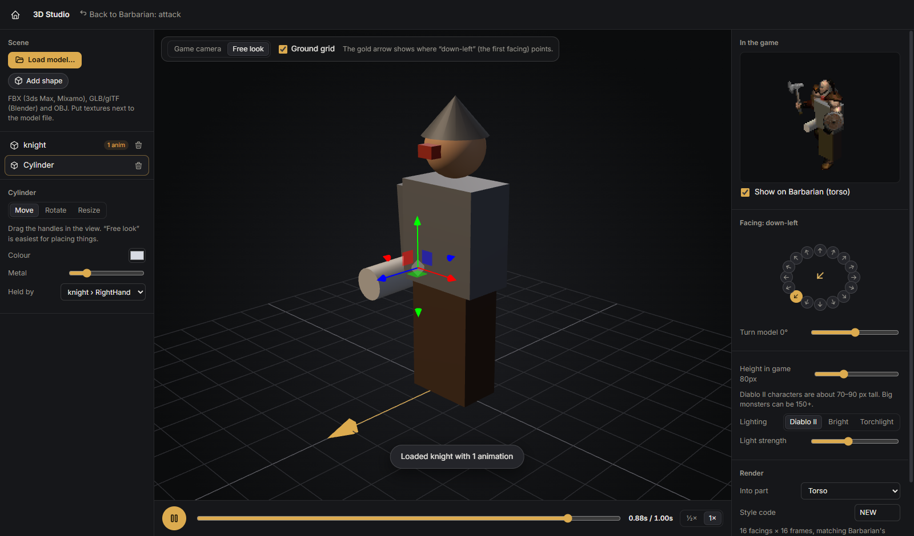
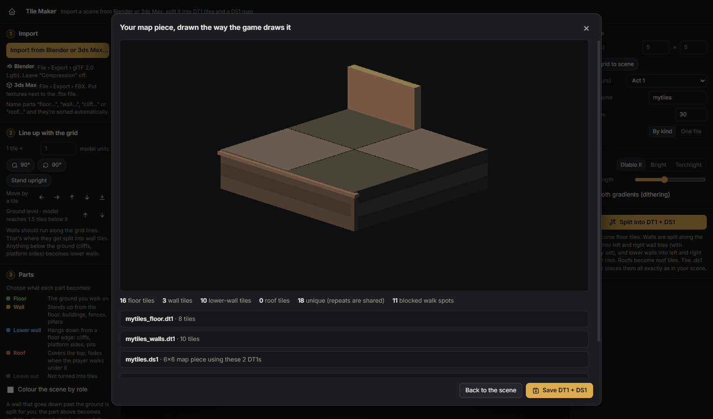
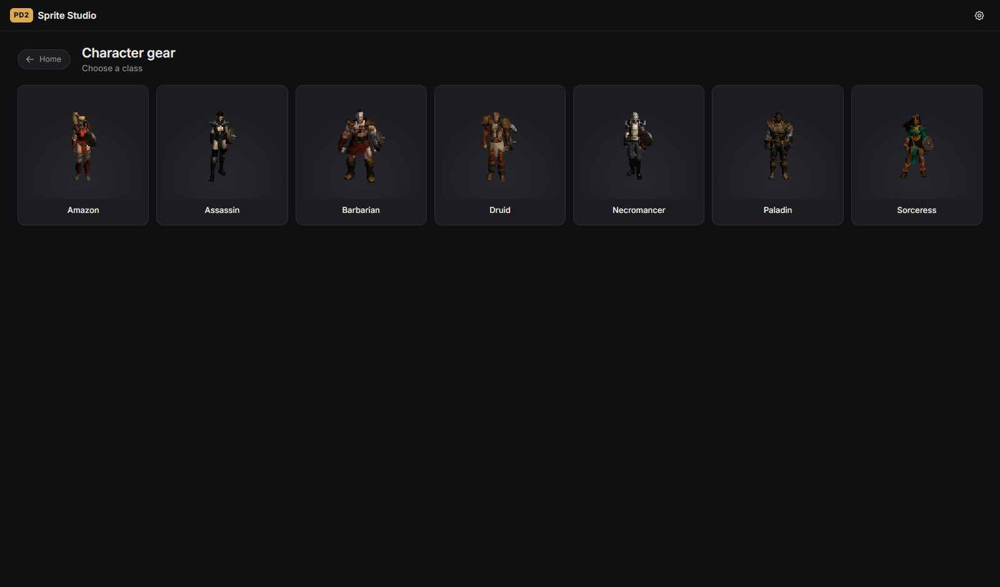
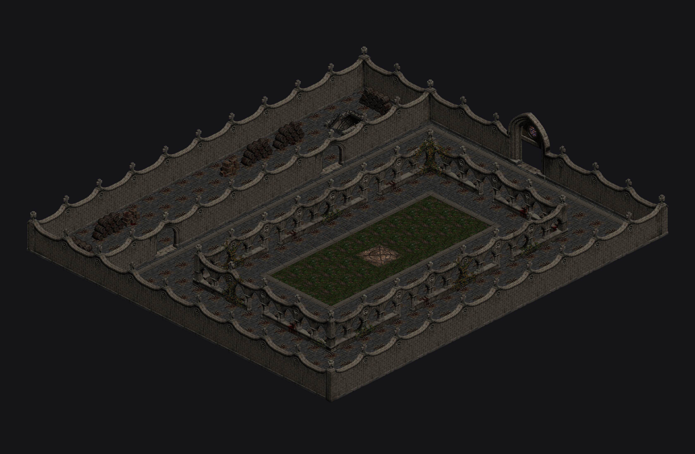
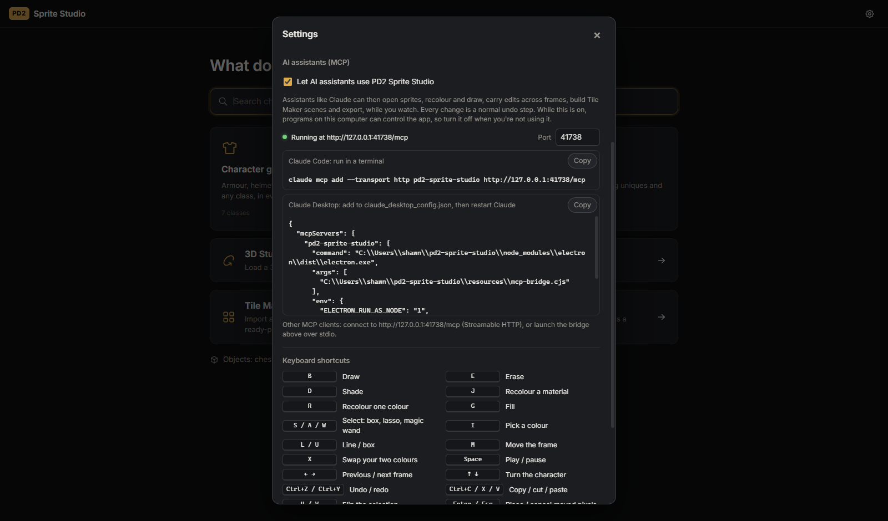
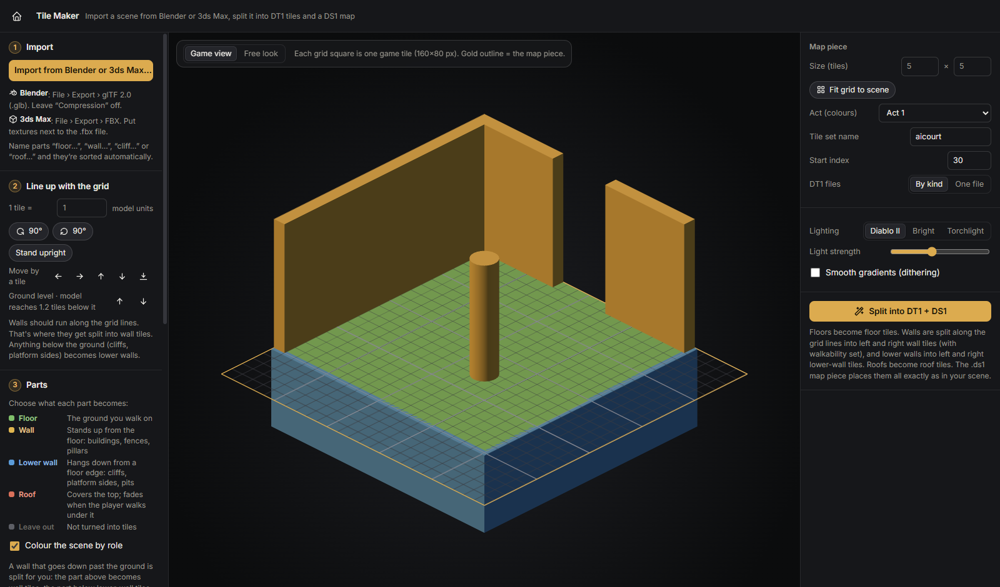

# PD2 Sprite Studio

Standalone sprite editor for Project Diablo 2. Reads sprites straight from your own Diablo II + ProjectD2
MPQ archives (nothing copyrighted is bundled) and writes edited files back out in PD2's formats.

A fuller write-up (screens, format-accuracy results, pipeline and known limits) is in
[`docs/showcase.html`](docs/showcase.html). Refresh the screenshots with
`npm run build && npx electron scripts/capture.cjs`.

| | |
|---|---|
|  |  |
|  |  |
|  |  |
|  |  |

## Run

```
npm install
npm run dev        # development (hot reload)
npm run build && npm start
```

To build the Windows installer (`release/PD2-Sprite-Studio-Setup-<version>.exe`):

```
npm run dist
```

Game folders default to `C:\Program Files\Diablo II` and its `ProjectD2` subfolder; change them in **Settings**.

## Features

- **Sprite database**: every character, monster and object animation (from COF/DCC listfiles), and every item
  inventory graphic, labelled from PD2's `weapons/armor/misc/uniqueitems/setitems/monstats` tables.
- **Pixel editing** restricted to the game palettes (ACT1–5, UNITS, …): pencil, eraser, fill, fill-all, replace colour,
  picker, line, rectangles, frame move, undo/redo.
- **Animated sprites**: all COF layers composited with draw order and draw effects. Edit any layer with the others
  ghosted, use onion skin, step frame by frame, and pick directions on a compass. A separate live preview window runs
  at the game's animdata speed.
- **Transfer edits → frames**: carries edits from one frame to others using motion tracking (each edited area is
  located in later frames by local pixel matching), whole-frame recolour, or same-position copy. Every target frame
  shows a before/after preview and can be accepted or rejected.
- **Bodies**: switch the body (keeps your edited layers), change armtype per layer (LIT/MED/HVY, weapon codes), or take
  a layer from another unit. You can also create blank layers and save a layer under a new armtype code.
- **Colour selector**: pick any colour (HSV/hex/RGB) and snap it to the closest palette entries (ΔE shown). It also
  shows a shading ramp for the active colour and can sort the palette by index, hue or brightness.
- **Tools for altering existing sprites**:
  - *Ramp shift* (J): recolour a whole material, either by swapping to another hue while keeping its shading or by
    HSV adjustment. Applies to the connected area or to every matching colour.
  - *Shade brush* (D): left lightens and right darkens, one step along each pixel's own ramp.
  - *Selection* (S rectangle, A lasso, W wand): copy, cut and paste at the same position (so a part can move between
    frames), flip H/V, move with a drag or arrow keys, and *Mirror → opposite direction* (e.g. SW → SE, flipped about
    the unit's origin).
  - *Paint lock*: Opaque, Empty, one Colour, or a whole Material (ramp). Alt+click sets the lock colour.
  - *Reference image*: an overlay under or over the sprite with adjustable opacity, scale and position. Never exported.
  - *Compare*: hold `\` or the "Hold: original" button to see the game's original frame. *Show changes* highlights
    every changed pixel.
  - *Outline & clean-up*: auto-shaded outline, darken edges, or remove stray pixels and fill pinholes. Can be
    limited to the area around your edits.
  - *Apply to* scope: Replace colour, Fill all, Ramp shift and Outline can run on this frame, this direction, or every
    direction, as a single undo step.
- **3D Studio** (start screen, or More › Open the 3D Studio): a built-in three.js workspace.
  - Load FBX (3ds Max, Mixamo), GLB/glTF (Blender) or OBJ models, with textures next to the file and their
    animations.
  - Build simple props from boxes, cylinders, spheres, cones and capsules. Move, rotate and resize them with
    on-screen handles, colour them, and attach them to a model's bone or node (e.g. a blade held in a hand).
  - Diablo II's camera (orthographic, 30° elevation, 45° azimuth) with a free-look orbit view, lighting
    presets, a target height in game pixels, and a facing turntable.
  - A live preview in the game's colours, optionally composited onto the open body.
  - One click renders every facing × frame (matching the open animation's counts) straight into a body
    part, or saves PNG renders for the importer.
- **Tile Maker** (start screen): import a map scene made in **Blender** (File › Export › glTF 2.0 .glb, compression
  off) or **3ds Max** (File › Export › FBX), and split it into Diablo II map tiles plus a DS1 map piece.
  1. **Import**: GLB/glTF, FBX or OBJ, with textures from the same folder.
  2. **Line up**: "1 tile = N model units" (auto-guessed: tile-scale, metres ≈ 2, centimetres ≈ 200), stand a
     Z-up model upright, turn it in 90° steps, move it by tiles, and snap it to the grid. Walls should run
     along the grid lines.
  3. **Parts**: each part becomes **Floor** (the ground you walk on), **Wall** (stands up from the floor),
     **Lower wall** (hangs down from a floor edge: cliffs, platform sides, pits), **Roof**, or is left out. Roles
     are guessed from names like `floor…`, `wall…`, `cliff…`/`ledge…` and `roof…`; a legend explains each one and
     *Colour the scene by role* tints the model so mistakes stand out. Snap puts the main floor (not the lowest
     point) on the ground, and anything below it automatically becomes lower walls; ▲▼ change the ground level.
  - **Split** renders with the game's exact tile camera (160×80 px per tile). Floors are sampled into diamond
    floor tiles, and walls are split along the grid lines into left (orientation 1) and right (orientation 2)
    wall tiles, with walkability flags from the geometry, using each surface's facing so corners stay on the right
    wall. Lower walls become orientation 16/17 tiles (drawn before floors, no walk flags, like the game's). Roofs become orientation-15 tiles raised to the roof
    height. Identical tiles are shared.
  - **Output**: `<name>_floor.dt1`, `<name>_walls.dt1` and `<name>_roof.dt1` (or one combined `.dt1`), plus a
    ready-placed `<name>.ds1` (v18) listing them, under `data\global\tiles\act<n>\<name>\`, for ds1-studio.
    The preview is drawn with the game's placement rules.
  - **Verified**: all v7 DT1s and 2,593 DS1s in the archives round-trip, a real map renders correctly with
    these rules, and a synthetic scene sliced, saved (split), re-read and re-rendered matches pixel for pixel.
- **AI assistants (MCP)**: Settings › *AI assistants* turns on a local Model Context Protocol server (off by default,
  `127.0.0.1:41730`), so an assistant such as Claude can drive the open app while you watch. 31 tools cover searching and
  opening sprites, viewing frames and sheets (results include pictures), palette lookups, drawing, material recolours, HSV
  shifts, outline/clean-up, image import, edit transfer across frames, undo/redo, PD2 and image export, and the whole Tile
  Maker (add blocks, import models, roles, settings, split with a game-rule preview, save). Every edit is a normal undo step.
  - Claude Code: `claude mcp add --transport http pd2-sprite-studio http://127.0.0.1:41730/mcp`
  - Claude Desktop / other stdio clients: Settings shows a ready `claude_desktop_config.json` block that runs the bundled
    `resources/mcp-bridge.cjs` with the app's own executable (`ELECTRON_RUN_AS_NODE=1`), so no Node install is needed.
  - Requests from web pages (other origins/hosts) are refused. While it's on, any program on the PC can control the app.
  - Test: `npm run build && node scripts/testMcp.cjs` (launches the app with a throwaway settings folder).
- **3D renders → body parts** (More › Import 3D renders, or Body parts › Use 3D renders): model and animate in
  Blender or 3ds Max, render with the included camera scripts (`render-scripts/d2_render_blender.py`,
  `render-scripts/d2_render_3dsmax.ms`; also downloadable from the import dialog), then import the folder. The
  importer maps rendered facings to the game's direction order (8 ↔ 16 handled), resamples frame counts, aligns
  the ground point, scales down, matches colours to the palette (optional dithering) and previews the result on
  the body before replacing or adding a part under a style code.
- **DCC cell check**: DCC stores at most 4 colours per 4×4 cell; offending cells are outlined in red and reduced on export.
- **Exports**: frame PNG/JPEG, animated GIF (one or all directions), sprite sheets, a "procedural positions" still
  (all frames drawn at their in-game offsets), PD2 `.dc6` / `.dcc` (+ optional `.cof`) under `data\global\…` in the
  export folder, "Save as" for single files, and PNG import (colours matched to the nearest palette entry).
- **Items**: the in-game tint preview uses the item's colormap (InvTrans) and unique/set colour.

## Layout

- `src/core`: format code with no Electron dependency (MPQ + PKWARE explode, DC6, DCC encoder/decoder, COF,
  animdata, palettes/colormaps, compositing, edit transfer, catalog).
- `src/main`: Electron main process (archive access, dialogs, export, MCP server in `mcpServer.ts`). `src/renderer`: React UI
  (MCP tools run in `mcp.ts`). Tool definitions shared by both: `src/core/mcpTools.ts`.
- `scripts/selftest.ts`: round-trip tests against your local game files (`npm test`).
- `scripts/webdev.ts`: runs the UI in a normal browser at http://localhost:5198 for testing (saves go to `out-test/`).
